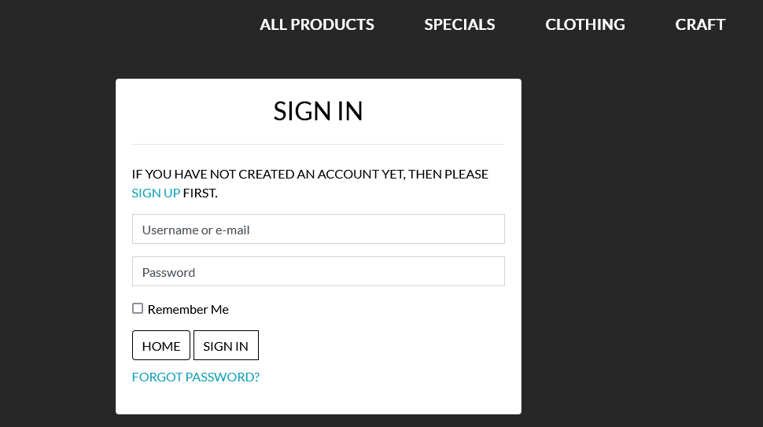

# BMDESIGNS

## E-Commerce store for personalised items.
------------------------------------

[View the live site here](https://milestone-project-4-bmdesigns-bfbe9959c9ae.herokuapp.com/)

BMDesigns is a small craft business specializing in personalised items.

BMDesigns is a fully functional E-Commerce store built in Django using Python, JavaScript, CSS, Bootstrap5, HTML and it incorporates stripe payments.
The site includes user authentication and Full CRUD functionality for products.

## Table of Contents

- [**Project Goals**](#project-goals)
- [**User Experience UX**](#user-experience-ux)
- [**Wireframes**](#wireframes)
- [**Features**](#features)
- [**Technologies**](#technologies)
- [**Testing**](#testing)
- [**Deployment**](#Deployment)
- [**Credits**](#credits)
- [**Acknowledgements**](#acknowledgements)

## Project Goals

The main aim of the site is to give users a place to buy personalised items.

The target audience is anyone wanting to buy items for themself or as a gift.

This version has been built for project 4 of the Code Institute Diploma in Software Development and therefore doesn't accept real payments and any orders made won't be fulfilled.

The idea came from a family member who sells these products on social media and would like a website.

If you would like to test the payment functionality please feel free to do so by entering the card details below when prompted:

`Card number: 4242 4242 4242 4242  Exp: any future date eg. 11/26 CVC: any 3 digits eg 123`

### User goals

* Enjoyable experiance on the site.
* To be able to create an account.
* Easily login and logout.
* Recieve email confirmation after registering.
* To be able to customize my account.
* View a list of products.
* View individual product details.
* Easily view total of purchases.
* Search for a product.
* Easily select a size and quantity.
* View items in my bag to be purchased.
* Adjust the quantity of items in bag.
* Easily enter my payment information.
* Have a profile that saves personal information.
* View an order confirmation after checkout.
* Recieve email confirmation after checkout order.

### Developer goals

* Create a clean responsive interactive website for milestone project.
* An easy to navigate site.
* A project that would be good enough to go in a portfolio.
* A site to sell products.
* To provide the site owner with a place to showcase work and expand there digital presence.
* I want potential users to know from the start what the site's purpose is.
* I want potential users to be able to register for an account.
* I want existing users to be able to be able to login.
* I want to add products utilizing the site or django admin.
* I want to edit/update products utilizing the site or django admin.
* I want to be able to delete products utilizing the site or django admin.

## User Experience - UX

### Scope

#### Potential/Existing User Stories

- User Sign in or Sign out
	* User Account Login / Logout - As a User, I would like to be able to login or logout of my account, so that I can avail of the sites full functionality.
	* Receive Welcome Emails - As a user I would like to receive a welcome email upon signing up.
    * Reset password Functionality - As a user I would like to be able to reset my password to keep my account safe.
    * Visibly logged in or out - As a user I would like to know if I am logged in or not.

- Landing page
	* As a User I would like to be brought to the landing page upon first visiting the site so that I can see what options are available to me.
    * As a User from the landing page I should clearly be able to see and navigate the navbar.
    * As a User on the landing page I should be easily able to go straight to the shop and purchase an item.

- View Products, Admin CRUD
    * As a user I should be easily able to see a list of products available.
    * As a user I should be able to click on any item to see more information about it.
    * As an Admin I can add products to the database.
    * As an admin I can edit products in the database.
    * As an admin I can delete products from the database.

- Shopping Cart
    * As a user I can easily view the contents of my Cart.
    * As a user I can easily add/edit/delete the contents of my bag.
    * As a user I can easily identify the total cost of my bag.

- User Feedback/Confirmation
    * As a user I receive prompt feedback concerning my activity on the site.
    * As a user I can see a order confirmation message.
    * As a user I receive an order confirmation email.

- Payment Feature
    * As a user I can visit a payment screen.
    * As a user I can input my credit/debit card details.

- User Profile
    * As a user I can sign in/create a profile so that personal information can be stored.

- Social links
    * As a user I can easily find social media links and when pressed they take me to the correct site.

- Customer Reviews
    * As a user I can clearly see reviews left by past customers.

### Design Choices

#### Fonts

* The fonts used were taken from [Google Fonts](https://fonts.google.com/)
* The font Lato was used because it is popular and therefore more recognisable.

#### Icons

* Icons used were taken from [Font awesome](https://fontawesome.com/)
* All icons used were chosen because they are easily recognisable to clients.

#### Colours

* The primary colour choices of white and raisin black were chosen for the navbar and background because they have a clean clear aspect while contrasting well with each other, the raisin black overlay was taken from the logo.
* Black, grey and white were chosen to make the writing stand out against the background.
* Sky blue and rusty red were used for highlight certain links.

#### Styling

* I have used Bootstrap throughout the site primarily to assist with design and responsiveness and added my own custom styling.

#### Images

* The logo and products were given to me by a family member who sells personalised items on social media.
* The social media links are taken from [Font awesome](https://fontawesome.com/).

## Wireframes

Wireframes for the project were developed after the idea was scribbled on a piece of paper, the program used being [Visual Paradigm](https://online.visual-paradigm.com).

### Desktop Wireframe

* Home Page

* Product Page

* Product Detail Page

* Checkout Page

* Checkout Success Page

* Register/Login Page

* Profile Page

### Mobile Wireframe

* Home Page

* Product Page

* Product Detail Page

* Checkout Page

* Checkout Success Page

* Register/Login Page

* Profile Page

## Features

The ecommerce website is designed to strictly adhere to accessibility guidelines across all pages, with easy navigation between them. Device responsiveness approach taken throughout project. The plan for this project was carried out using the Agile Methodology in Github.

### Front-End Structure

#### Navbar and Footer

* The navbr and footer were taken from bootstrap and styled to suit needs. The same navbar and footer used on every page for easy navigation. Added social media links to the footer.

The website is split into 6 apps each with there own html, models, views urls and forms. A number of other folders and files were used for allauth, css and media.

1. Home - index.html
- Landing page, and first page user encounters when they visit the website, includes a link to the products page.

2. Register - register.html
- The user is able to register an account to the website.

3. Log In - signup.html
- The user is able to log in to the website using an existing account, otherwise they are invited to create a new one. Once logged in they are redirected to the home page.

4. Profile - profile.html
- Available only to the user logged in via which they can view and save their account/personal info, also provides order history.

5. Products - products.html
- A page where users can see all products.

6. Product Detail - product_detail.html
- A page where users can select a product and see all customization details aswell as sizes and quantity.

7. Add Product - add_product.html
- Only available to superusers so they can add new products.

8. Edit Product - edit_product.html
- Only available to superusers so they can edit existing products. The same as add product except all the original fields are already filled in and editable.

9. Bag - bag.html
- A page where users can see the products that they have selected to buy aswell as the total cost.

10. Checkout - checkout.html
- A page where users can fill in there personal details and complete an order.

11. Checkout Success - checkout_success.html
- A page where users can see there order confirmed with all the details.

### Back-End Structure

#### Physical Database Model

Below model displays all fields stored in the database collection.

There are 6 individual models in 3 apps
- Category - stores all categories.
- Color - stores all colour options.
- Product - stores product data.
- Order - stores users details.
- OrderLineItem - stores product order details.
- UserProfile - stores profile data.

* Built with Django using Postgresql and AWS for the database.
The application structure is as follows:
* bm_designs - contains all main set up for the website.
* home - contains all index/home content for the website.
* products- contains all product content for the website.
* profiles - contains all profile content for the website.
* bag - contains all bag content for the website.
* checkout - contains all checkout content for the website.
* templates - contains all base.html and allauth files for the website.
* static - contains all css, js and images for the website.
* media - contains all images for the website.
* Application is created and setup by running python3 manage.py runserver.

Additional gadgets used in back-end:

* django-allauth
* django-countries
* django-crispy-forms
* django-storages
* gunicorn
* stripe
* Pillow

## Technologies

### Languages

This project was built using [HTML5](https://en.wikipedia.org/wiki/HTML5),[CSS3](https://en.wikipedia.org/wiki/CSS) and [JS](https://www.javascript.com/) using a link from [Python](https://www.python.org/).

### Frameworks

Here is a list of the following technologies used in this project:

- [HTML5](https://en.wikipedia.org/wiki/HTML5)
HTML 5 was used to create the structure of the website.
- [CSS3](https://en.wikipedia.org/wiki/CSS)
CSS 3 was used to style the website.
- [JS](https://www.javascript.com/)
JS was used to give interactivity.
- [Python](https://www.python.org/)
Python was used for its database mechanics.
- [SQLAlchemy](https://www.sqlalchemy.org/)
 SQLAlchemy was used for its database mechanics.
- [AWS](https://aws.amazon.com/)
 AWS was used for its database mechanics.
- [GitHub](https://github.com/)
GitHub was used to store the projects code.
- [Gitpod](https://gitpod.io/)
Gitpod terminal was used to commit my code using Git and push it to Github.
- [Heroku](https://heroku.com/)
Heroku was used to deploy the project.
- [Bootstrap](https://getbootstrap.com/)
Bootstrap was used for its easy design and responsiveness.
- [Am I Responsive](https://ui.dev/amiresponsive)
Am I responsive was used to ensure the website is responsive on all devices.
- [W3C Validation](https://validator.w3.org/)
W3C Validation was uesd for checking HTML and CSS for mistakes.
- [ES6 Validator](https://www.piliapp.com/syntax-check/es6/)
ES6 Validator was uesd for checking JS files for mistakes.
- [pycodestyle Validator](https://pypi.org/project/pycodestyle/)
Pycodestyle Validator was uesd for checking Python files for mistakes.
- [Visual Paradigm](https://online.visual-paradigm.com)
Visual Paradigm was uesd for physical database model.

## Testing

### Browsers

Developer tools on Firefox and Google Chrome were used throughout the project.
The website was tested on three different browsers with no problems:

* Microsoft Edge
* Google Chrome
* Mozila Firefox

### Mobile

Developer tools on Firefox and Google Chrome were used throughout the project to check site responsiveness.
Checked the website on my own mobile and other family members with no problems:

* Iphone
* Samsung Galaxy
* Dev Tools Mobile Responsiveness

### HTML Validator

HTML Validator using [W3C Validation](https://validator.w3.org/) confirms no errors or warnings.

### CSS Validator

CSS Validator using [W3C Validation](https://jigsaw.w3.org/css-validator/) with the only error bieng from an imported materialize file that I dont have access to.

### JS Validator

JS Validator using [ES6 Syntax Check](https://www.piliapp.com/syntax-check/es6/) confirms no errors found.

### Python Validator

Python Validator using [pycodestyle Syntax Check](https://pypi.org/project/pycodestyle/) was used to validate Python code for PEP8 compliance.

### Manual Testing

* Landing/Home Page - Due to the nature and structure of the website, the user can tell immediately what the goal of the site is - As expected.
* Log In Page - User clicks on Log In button in the navbar which takes them to the sign up page where they can create an account - As expected.
* Register Page - User clicks on Register button in the navbar which takes them to the registration page where they can create a profile - As expected.
* Profile Page - User clicks on Profile button in the navbar which takes them to the profile page where they can edit personal info and look at orders - As expected.
* Home Page - User clicks on Home button in the navbar which takes them to the home page where they can see a list of most recent posts - As expected.
* Products Page - User clicks on Shop Now button in the home page which takes them to the products page where they can browse the product range - As expected.
* Products Detail - User clicks on a product which takes them to the product deatail page where they can customize a product before purchasing - As expected.
* Bag - User clicks on add to bag in product deatail which takes them to the shopping bag where they can review there order and update or delete orders - As expected.
* Checkout Page - User clicks on checkout button in the bag page which takes them to the checkout page where they can see there order and fill in there personal info and credit card details to complete purchase, if the user creates an account there details are stored - As expected.
* Checkout Success - User clicks on complete order button in the checkout page which takes them to the checkout success page where they get all the order and delivery address info and an email confirming there purchase - As expected.
* Customized Products - Tested all different customizable and size combinations of products through to the checkout success to make sure they all saved - As expected.

### Bugs

* Social link not showing on webpage once deployed:
FIX - Changed the icons to [Font awesome](https://fontawesome.com/).
* Not all products showing details with sizes in checkout:
FIX - Changed the add_to_bag views.

### Future Updates

* Add colour background to colour options, started but didn,t finish in time for project submission.
* Add contact page.
* Add different sizes for different aged clothes.

## Deployment

### Github

To clone this project into Github you will need:

1. A Github account.
2. Install the Gitpod extension.
3. Log into Gitpod with your Github account.
4. On the GitHub website find and click on the [Github repository](https://github.com/CHRISHA1122/milestone-project-4) of intrest.
5. Locate the green button named Gitpod in the top right corner of the repository and click on it,
6. This will trigger a new Gitpod workspace to be created from the code in Github where you can work locally.

### Heroku

1. In app.py file, ensure that debug is not enabled, i.e. not set to True.
2. Create a plan file with no extensions called 'Procfile' in the root directory of your project (if it doesn't already exist), within it add the line 'web: python app.py' (essentially same thing we do when we run our program locally).
3. Create a requirements.txt file by running the command the following command in your terminal:
- `pip freeze --local > requirements.txt`
4. Procfile and requirements.txt files should both be committed to your Git repository.
5. Create an account on [Heroku](https://signup.heroku.com/login?redirect-url=https%3A%2F%2Fid.heroku.com%2Foauth%2Fauthorize%3Fclient_id%3D8ba4d6bc-6d8c-4de8-8d31-9e540595c199%26redirect_uri%3Dhttps%253A%252F%252Fdevcenter.heroku.com%252Fauth%252Fheroku%252Fcallback%253Fback_to%253D%252F%26response_type%3Dcode%26scope%3Didentity%26state%3D5627683e234758322a2e4a8ae45f254b4883a8266b26975c).
6. Create a new application and name it same as your project (if name is available, if not choose one).
7. In the application dashboard, navigate to the 'Deploy' section.
8. Link your GitHub account in the Deployment method section, then in the 'App connected to GitHub' select your project repository. Enable automatic deployment if desired, otherwise deployment will need to be manually done.
9. Next, configure your 'Config Vars'. Those should contain sets of key-value pairs of the keys you have stored in your local env.py, such as:
  - IP
  - PORT
  - SECRET_KEY
  - MONGO_URI
  - AWS_ACCESS_KEY_ID
  - AWS_SECRET_ACCESS_KEY
10. Go to the project dashboard and in 'Manual Deploy' section select the correct branch, then click 'Deploy Branch' button.
11. This will trigger the site's deployment. Once deployment has completed, click on the "Open App" button to open the deployed application.

If the above steps have been followed correctly you will be greeted by your website's landing page.

### ElephantSQL

1. Navigate to ElephantSQL.com and click “Get a managed database today”.
2. Select “Try now for FREE” in the TINY TURTLE database plan.
3. Select “Log in with GitHub” and authorize ElephantSQL with your selected GitHub account.
4.  Create new team:
 - Add a team name (your own name is fine)
 - Read and agree to the Terms of Service
 - Select Yes for GDPR
 - Provide your email address
 - Click “Create Team”
 -You should get a message saying Your account is successfully created!.
5. Click “Create New Instance”.
6. Set up your plan:
 - Give your plan a Name (this is commonly the name of the project).
 - Select the Tiny Turtle (Free) plan.
 - You can leave the Tags field blank.
7. Select “Select Region”.
8. Select a data center near you.
9. Then click “Review”.
10. Check your details are correct and then click “Create instance”.
11. Return to the ElephantSQL dashboard and click on the database instance name for this project.
12. In the URL section, clicking the copy icon will copy the database URL to your clipboard you will need it for the heroku set up.

### AWS

! NOTE: These instructions are for setting up AWS hosting as of 5/1/23 - these may change slightly in future versions of AWS.

1. Sign up or login to your [aws amazon account](https://aws.amazon.com) on the top right by using the manage my account button and then navigate to S3 to create a new bucket.
2. The bucket will be used to store our files, so it is a good idea to name this bucket the same as your project. Select the region closest to you. In the object ownership section we need to select ACLs enabled and then select bucket owner preferred. In the block public access section uncheck the block public access box. You will then need to tick the acknowledge button to make the bucket public. Click create bucket.
3. Click the bucket you've just created and then select the properties tab at the top of the page. Find the static web hosting section and choose enable static web hosting, host a static website and enter index.html and error.html for the index and error documents (these won't actually be used.)
4. Open the permissions tab and copy the ARN (amazon resource name). Navigate to the bucket policy section click edit and select policy generator. The policy type will be S3 bucket policy, we want to allow all principles by adding `*` to the input and the actions will be get object. Paste the ARN we copied from the last page into the ARN input and then click add statement. Click generate policy and copy the policy that displays in a new pop up. Paste this policy into the bucket policy editor and make the following changes: Add a `/*` at the end of the resource value. Click save.
5. Next we need to edit the the cross-origin resource sharing (CORS).
6. Now we need to edit the access control list (ACL) section. Click edit and enable list for everyone(public access) and accept the warning box.

#### Creating AWS groups, policies and users

1. Click the services icon on the top right of the page and navigate to IAM - manage access to AWS services. On the left hand navigation menu click user groups and then click the create group button in the top right. This will create the group that our user will be placed in.
2. Choose a name for your group - for example manage-seaside-sewing, and click the create policy button on the right. This will open a new page.
3. Click on the JSON tab and then click the link for import managed policy on the top right of the page.
4. Search for S3 and select the one called AmazonS3FullAccess, then click import.
5. We need to make a change to the resources, we need to make resources an array and then change the value for resources. Instead of a `*` which allows all access, we want to paste in our ARN. followed by a comma, and then paste the ARN in again on the next line with `/*` at the end. This allows all actions on our bucket, and all the resources in it.
6. Click the next: tags button and then the next:review .
7. Give the policy a name and description (e.g. seaside-sewing-policy | Access to S3 bucket for seaside sewing static files.) Click the create policy button.
8. Now we need to atach the policy we just created. On the left hand navigation menu click user groups, select the group and go to the permissions tab. Click the add permissions button on the right and choose attach policies from the dropdown.
9. Select the policy you just created and then click add permissions at the bottom.
10. Now we'll create a user for the group by clicking on the user link in the left hand navigation menu, clicking the add users button on the top right and giving our user a username (e.g. seaside-sewing-staticfiles-user). Select programmatic access and then click the next: permissions button.
11. Add the user to the group you just created and then click next:tags button, next:review button and then create user button.
12. You will now need to download the CSV file as this contains the user access key and secret access key that we need to insert into the Heroku config vars. Make sure you download the CSV now as you won't be able to access it again.

#### Connecting Django to our S3 bucket

1. Install boto3 and django storages and freeze them to the requirements.txt file.
- pip3 install boto3
- pip3 install django-storages
- pip3 freeze > requirements.txt
2. Add `storages` to the installed apps in settings.py
3. Add the following code in settings.py to use our bucket if we are using the deployed site:
- if 'USE_AWS' in os.environ:
    AWS_S3_OBJECT_PARAMETERS = {
    'Expires': 'Thu, 31 Dec 2099 20:00:00 GMT',
    'CacheControl': 'max-age=9460800',
    }  
- AWS_STORAGE_BUCKET_NAME = 'enter your bucket name here'
- AWS_S3_REGION_NAME = 'enter the region you selected here'
- AWS_ACCESS_KEY_ID = os.environ.get('AWS_ACCESS_KEY_ID')
- AWS_SECRET_ACCESS_KEY = os.environ.get('AWS_SECRET_ACCESS_KEY')
- AWS_S3_CUSTOM_DOMAIN = f'{AWS_STORAGE_BUCKET_NAME}.s3.amazonaws.com'
4. In Heroku we can now add these keys to our config vars:
- AWS_ACCESS_KEY_ID: The access key value from the amazon csv file downloaded in the last section |
- AWS_SECRET_ACCESS_KEY: The secret access key from the amazon csv file downloaded in the last 
- USE_AWS: True
5. Remove the DISABLE_COLLECTSTATIC variable.
6. Create a file called custom_storages.py in the root and import settings and S3Botot3Storage. Create a custom class for static files and one for media files. These will tell the app the location to store static and media files.
7. Add the following to settings.py to let the app know where to store static and media files, and to override the static and media URLs in production.
- STATICFILES_STORAGE = 'custom_storages.StaticStorage'
- STATICFILES_LOCATION = 'static'
- DEFAULT_FILE_STORAGE = 'custom_storages.MediaStorage'
- MEDIAFILES_LOCATION = 'media'
- STATIC_URL = f'https://{AWS_S3_CUSTOM_DOMAIN}/{STATICFILES_LOCATION}/'
- MEDIA_URL = f'https://{AWS_S3_CUSTOM_DOMAIN}/{MEDIAFILES_LOCATION}/'
8. Save, add, commit and push these changes to make a deployment to Heroku. In the build log you should be able to see that the static files were collected, and if we check our S3 bucket we can see the static folder which has all the static files in it.
9. Navigate to S3 and open your bucket. We now want to create a new file to hold all the media files for our site. We can do this by clicking the create folder button on the top right and naming the folder media.

#### **Setting up Stripe**

1. We now need to add our Stripe keys to our config vars in Heroku to keep these out of our code and keep them private. Log into Stripe, click developers and then API keys.
2. Create 2 new variables in Heroku's config vars - for the publishable key (STRIPE_PUBLIC_KEY) and the secret key (STRIPE_SECRET_KEY) and paste the values in from the Stripe page.
3. Now we need to add the WebHook endpoint for the deployed site. Navigate to the WebHooks link in the left hand menu and click add endpoint button.
4. Add the URL for our deployed sites WebHook, give it a description and then click the add events button and select all events. Click Create endpoint.
5. Now we can add the WebHook signing secret to our Heroku config variables as STRIPE_WH_SECRET.
6. In settings.py:
- STRIPE_PUBLIC_KEY = os.getenv('STRIPE_PUBLIC_KEY', '')
- STRIPE_SECRET_KEY = os.getenv('STRIPE_SECRET_KEY', '')
- STRIPE_WH_SECRET = os.getenv('STRIPE_WH_SECRET', '')

## Credits

### Code

I have used predominantly my own code and what I learned through the code institute lessons.

* [Code Institute](https://codeinstitute.net) what i've learned from the learning material.
* [Real Python](https://realpython.com/) for problems with database.
* [W3Schools](https://www.w3schools.com/) any trouble shooting.
* [Webtips.dev](https://www.webtips.dev/) any trouble shooting.

### Images

* Images used for icons were taken from [Font awesome](https://fontawesome.com/).
* All images for the products and the logo were given to me by a family member who sells them through social media.

## Acknowledgements

* I would like to thank the [Code Institute](https://codeinstitute.net) for the learning material and all the other support on offer.
* I would like to thank my mentor for all the help and guidence through the project.
* And last I would like to thank Shipley College and my tutor for all the help through the course.

